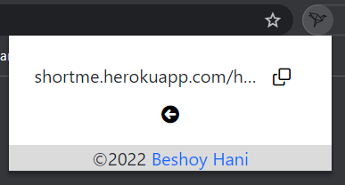

## ShortMe Chrome Extension
The extension uses [ShortMe API](https://github.com/BeshoyHani/Short.Me-API) to shorten the URLs.

## How to Setup
1) Clone the repo.
2) in your google chrome, select More Tools and then choose Extensions.
3) Make sure to enable the Developer mode.
4) Once that's done, you need to click the Load unpacked button which will allow you to load our project in the Chrome extensions

## Preview

